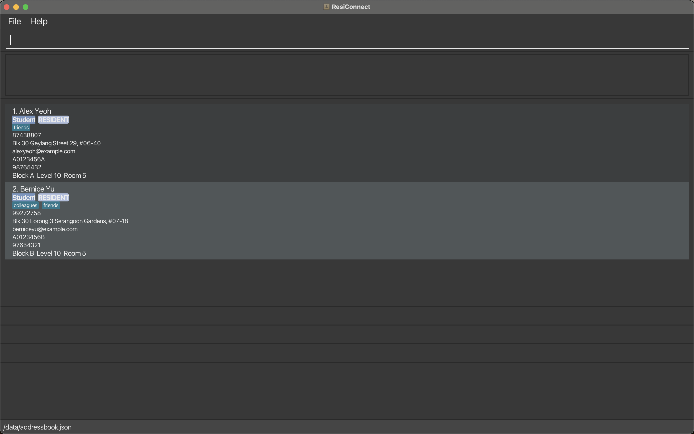

This project is based on the AddressBook-Level3 project created by the [SE-EDU initiative](https://se-education.org).
* _ResiConnect_ is a desktop application used to manage contact details specifically targeted at Resident Assistants/ Fellows.

* For the detailed documentation of this project, see the **[Address Book Product Website](https://se-education.org/addressbook-level3)**.
* This project is a **part of the se-education.org** initiative. If you would like to contribute code to this project, see [se-education.org](https://se-education.org/#contributing-to-se-edu) for more info.

