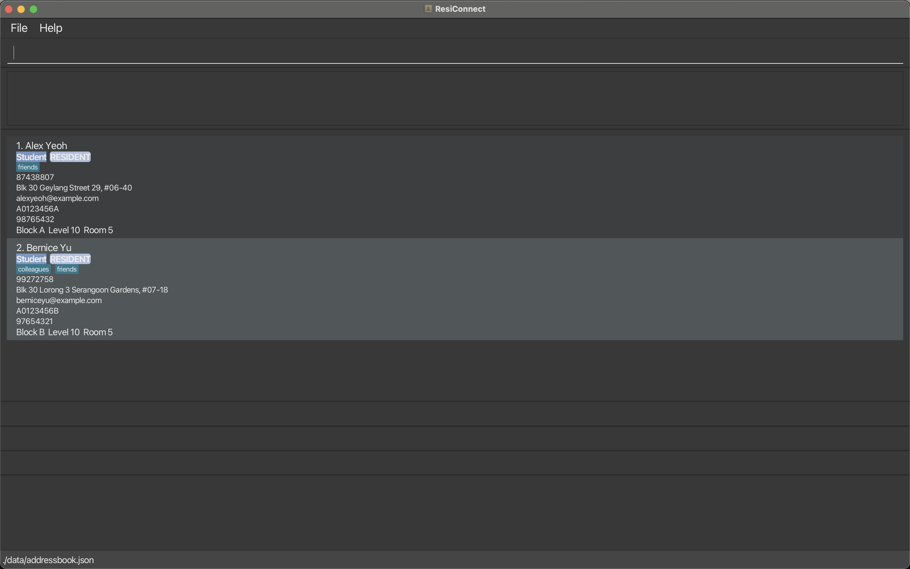
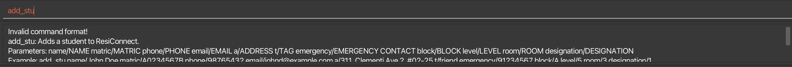
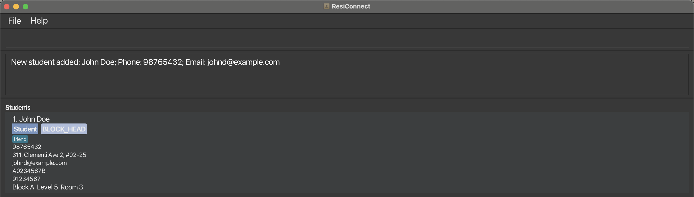
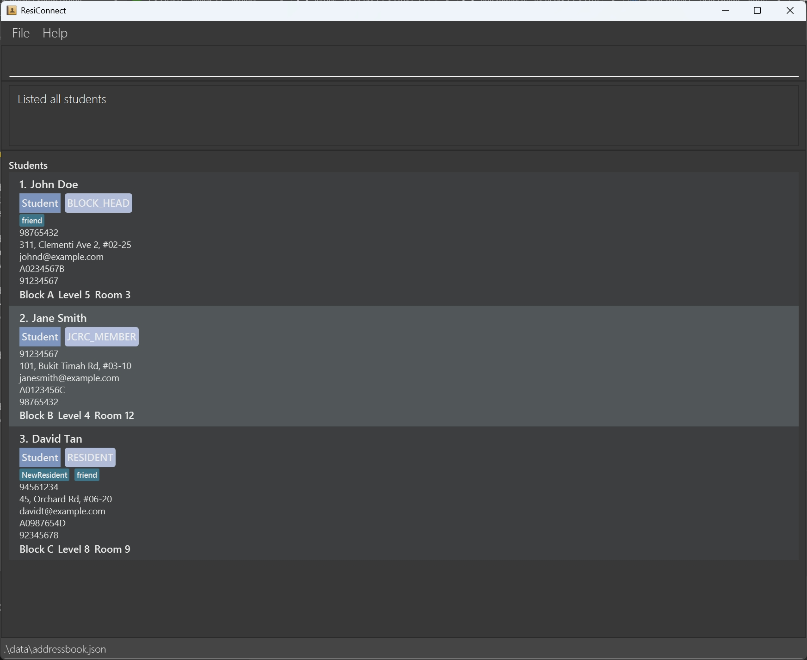
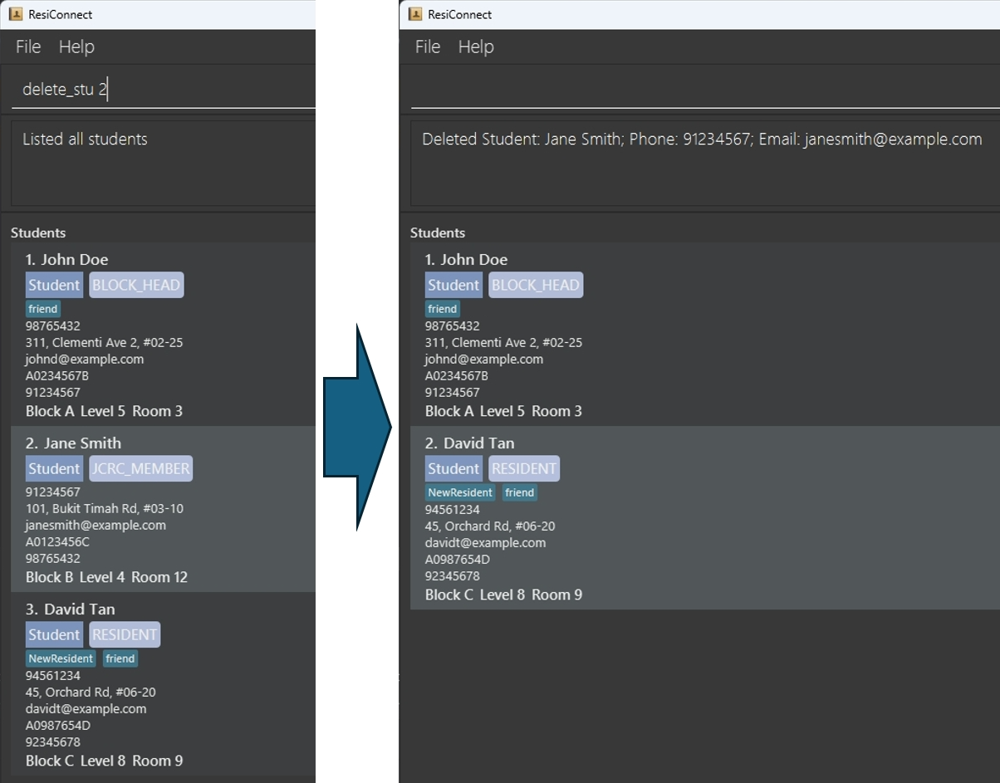
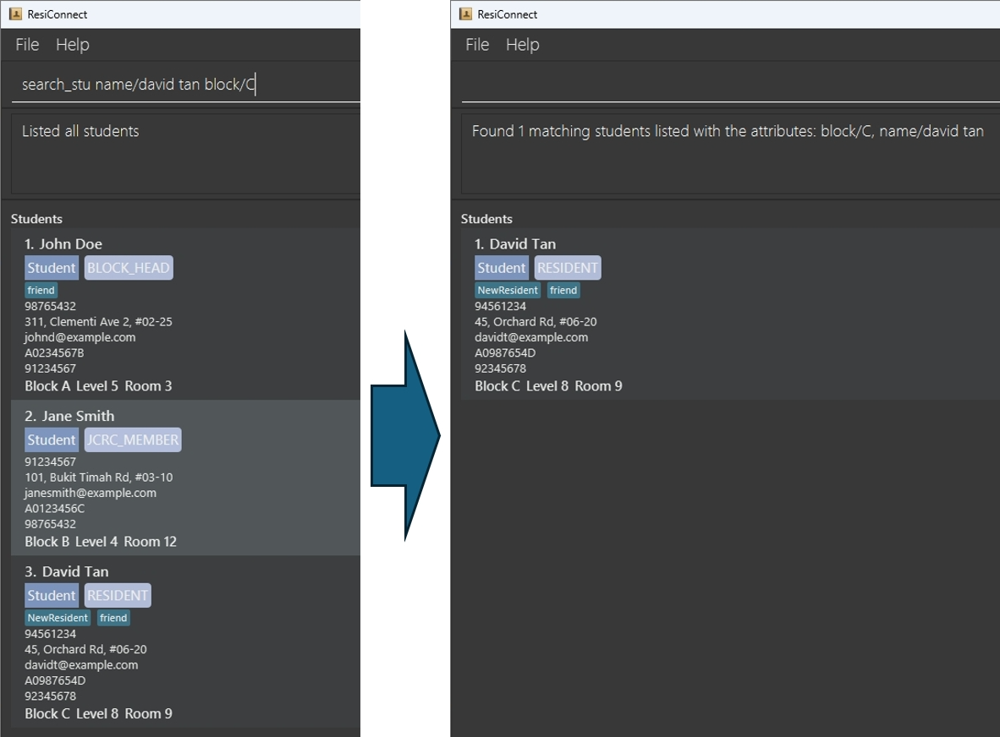
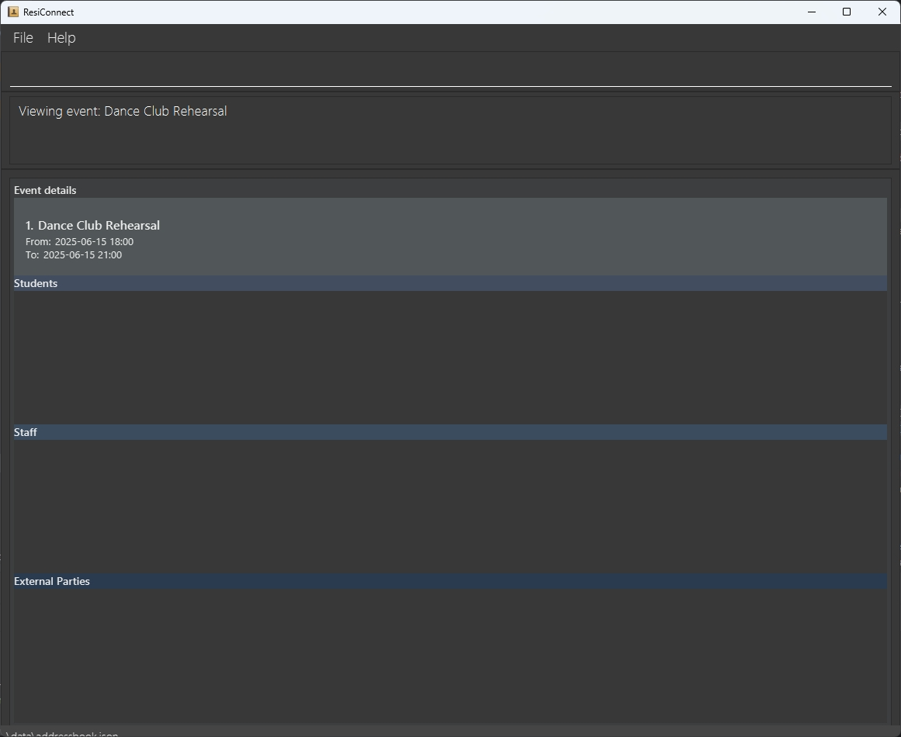
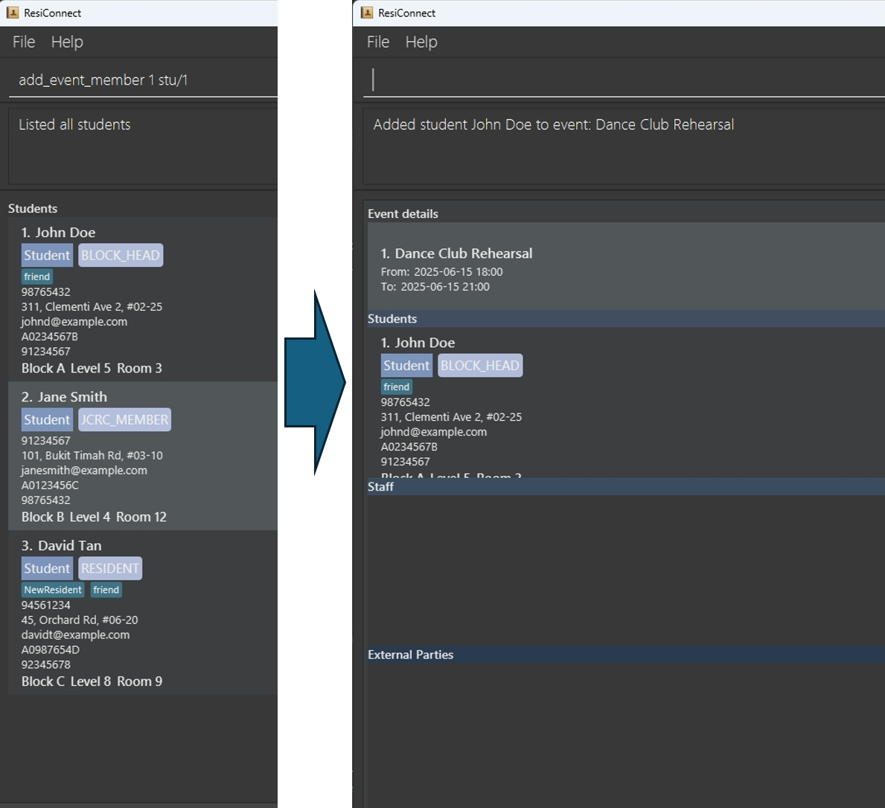
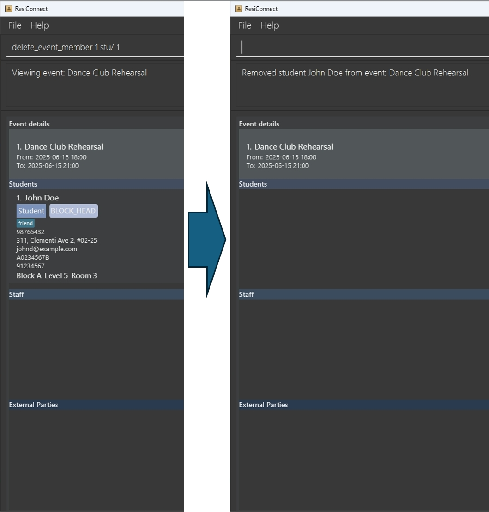

# ResiConnect User Guide

ResiConnect is a **desktop contact management app for Resident Fellows and students in the various halls and residential 
colleges in NUS to track students, staff, external parties and events.** 
It is optimized for use via a Command Line Interface (CLI) while still having the benefits of a Graphical User Interface (GUI). 
If you can type fast, ResiConnect can get your contact management tasks done faster than traditional GUI apps.

--------------------------------------------------------------------------------------------------------------------

## Table of Contents
1. [Quick Start](#quick-start)

2. [Definitions](#definitions)
   1. [Students](#students)
   2. [Staff](#staff)
   3. [External Parties](#external-parties)
   4. [Events](#events)

3. [Features](#features)
   1. [Viewing Help](#viewing-help--help)
   2. [Adding a Student](#adding-a-student-add_stu)
   3. [Adding a Staff](#adding-a-staff-add_staff)
   4. [Adding an External Party](#adding-an-external-party-add_ext)
   5. [Listing all Students](#listing-all-students--list_stu)
   6. [Listing all Staff](#listing-all-staff--list_staff)
   7. [Listing all External Parties](#listing-all-external-parties--list_ext)
   8. [Deleting a Student](#deleting-a-student--delete_stu)
   9. [Deleting a Staff](#deleting-a-staff--delete_staff)
   10. [Deleting an External Party](#deleting-an-external-party--delete_ext)
   11. [Searching for Students](#searching-for-students-search_stu)
   12. [Searching for Staff](#searching-for-staff-search_staff)
   13. [Searching for External Parties](#searching-for-external-parties-search_ext)
   14. [Adding an Event](#adding-an-event--add_event)
   15. [Listing an Event](#listing-all-events--list_event)
   16. [Deleting an Event](#deleting-an-event--delete_event)
   17. [Viewing an Event](#viewing-an-event--view_event)
   18. [Searching an Event](#searching-an-event--search_event)
   19. [Adding a Member into an Event](#adding-a-member-into-an-event-add_event_member)
   20. [Deleting a Member from an Event](#deleting-a-member-from-an-event-delete_event_member)
   21. [Searching for Event members](#searching-for-event-members-search_event_member)
   21. [Clearing all Entries](#clearing-all-entries--clear)
   22. [Exiting the Program](#exiting-the-program--exit)
   23. [Saving the Data](#saving-the-data)
   24. [Editing the Data File](#editing-the-data-file)

4. [Constraints for the Features](#constraints-for-the-features)

5. [FAQ](#faq)

6. [Known Issues](#known-issues)

7. [Command Summary](#command-summary)

--------------------------------------------------------------------------------------------------------------------

## Quick start

1. Ensure you have Java `17` or above installed in your Computer. 
   **Mac users:** Ensure you have the precise JDK version prescribed [here](https://se-education.org/guides/tutorials/javaInstallationMac.html).

1. Download the latest `.jar` file from [here](https://github.com/AY2425S2-CS2103T-T11-3/tp/releases).

1. Copy the file to the folder you want to use as the _home folder_ for your ResiConnect.

1. Open a command terminal, `cd` into the folder you put the jar file in, and use the `java -jar ResiConnect1.5.jar` command to run the application. 
   A GUI similar to the below should appear in a few seconds. Note how the app contains some sample data. 
   

1. Type the command in the command box and press Enter to execute it. e.g. typing **`help`** and pressing Enter will open the help window. 
   Some example commands you can try:

   * `list_staff` : Lists all staff in the address book.

   * `add_stu name/John Doe matric/A0234567B phone/98765432 email/johnd@example.com a/311, Clementi Ave 2, #02-25 
   emergency/91234567 block/A level/5 room/3 designation/1` : Adds a student named `John Doe` to the address book.

   * `delete_ext 3` : Deletes the 3rd external party shown in the current external party list.

   * `view_event 2` : Views the 2nd event in the address book, associated with its respective lists.

   * `exit` : Exits the app.

1. Refer to the [Features](#features) below for details of each command.

--------------------------------------------------------------------------------------------------------------------

## Definitions

Before we introduce the features of ResiConnect, it is important that we define how a student, staff, external party, and events are differentiated. This will allow you to better understand when ResiConnect allows you to add a student, staff, external party or event.

### Students

* No two students can have the same matriculation number, phone number or email address. Their names can be the same.  
* When you are adding a student, if any of the matriculation number, phone number or email address matches any other student, ResiConnect will prevent you from adding the student.

### Staff

* No two staff members can have the same phone number or email address. Their names can be the same.  
* When you are adding a staff, if any of the phone number or email address matches any other staff, ResiConnect will prevent you from adding the staff.

### External Parties

* No two external parties can have the same phone number or email address. Their names can be the same.  
* When you are adding an external party, if any of the phone number or email address matches any other external party, ResiConnect will prevent you from adding the external party.

<box type="important" seamless>

**IMPORTANT:**
Note that when you add any of the 3 person types above, ResiConnect will also check phone numbers and email addresses against the other remaining two person types.

For example, if you are attempting to add a student, ResiConnect ensures that there is no staff or external party that already has this student's phone number or email address.

</box>

### Events

No two events can have the same event name, start time and end time.  
As long as the combination of event name, start time and end time together do not match, ResiConnect will allow you to add a new event.
For example, if there already exists an event called "Feast", from 2025-01-01 18:00 to 2025-01-01 20:00, you can add another event that is also called "Feast", but happens from 2025-01-01 18:00 to 2025-01-01 21:00.

--------------------------------------------------------------------------------------------------------------------

## Features

<box type="info" seamless>

**Notes about the command format:** 

* For additional information about the constraints of each parameter. Please refer to the Constraints section, further below.

* Words in `UPPER_CASE` are the parameters to be supplied by the user. 
  e.g. in `add_stu name/NAME`, `NAME` is a parameter which can be used as `add name/John Doe`.

* Items in square brackets are optional. 
  e.g `name/NAME [designation/DESIGNATION]` can be used as `name/John Doe designation/1` or as `name/John Doe`.

* Parameters can be in any order. 
  e.g. if the command specifies `name/NAME phone/PHONE_NUMBER`, `phone/PHONE_NUMBER name/NAME` is also acceptable.

* Extraneous parameters for commands that do not take in parameters (such as `help`, `list_stu` and `exit`) will be 
ignored. 
  e.g. if the command specifies `help 123`, it will be interpreted as `help`.

* If you are using a PDF version of this document, be careful when copying and pasting commands that span multiple lines as space characters surrounding line-breaks may be omitted when copied over to the application.
</box>

<box type="info" seamless>

**Additional notes about the commands:** 

* If there are any errors in the commands that you have written, the text bar's font colour will turn red (from white).

* For any commands that makes reference to the index of a list, it is done with respect to the full, unfiltered lists given by list_stu for students, list_staff for staff, list_ext for external parties, and list_event for events.
</box>

### Viewing help : `help`

Shows a message explaining how to access the help page.

Format: `help`

### Adding a student: `add_stu`

Adds a student to the address book.

Format: `add_stu name/NAME matric/MATRIC phone/PHONE email/EMAIL a/ADDRESS [t/TAG] emergency/EMERGENCY CONTACT block/BLOCK level/LEVEL room/ROOM [designation/DESIGNATION]`

<box type="tip" seamless>

**Tip:** You can omit the designation field, and ResiConnect will put the lowest position available as the default. To specify it, place an integer from 0 to 2, representing {“Resident”, “Block Head”, “JCRC Member”} respectively.
</box>

Examples:
* `add_stu name/John Doe matric/A0234567B phone/98765432 email/johnd@example.com a/311, Clementi Ave 2, #02-25 t/friend emergency/91234567 block/A level/5 room/3 designation/1`

### Adding a staff: `add_staff`

Adds a staff to the address book.

Format: `add_staff name/NAME phone/PHONE email/EMAIL a/ADDRESS [t/TAG] emergency/EMERGENCY CONTACT block/BLOCK level/LEVEL room/ROOM [designation/DESIGNATION]`

<box type="tip" seamless>

**Tip:** You can omit the designation field, and ResiConnect will put the lowest position available as the default. To specify it, place an integer from 0 to 2, representing {“Support Staff”, “Block IC”, “Residence Master”} respectively.
</box>

Examples:
* `add_staff name/John Doe phone/98765432 email/johnd@example.com a/311, Clementi Ave 2, #02-25 t/neighbour emergency/91234567 block/A level/5 room/3 designation/1`

### Adding an external party: `add_ext`

Adds an external party to the address book.

Format: `add_ext name/NAME phone/PHONE email/EMAIL desc/DESCRIPTION`

Examples:
* `add_ext name/John Doe phone/98765432 email/johnd@example.com desc/Food Vendor`

### Listing all students : `list_stu`

Shows a list of all students in the address book.

Format: `list_stu`

### Listing all staff : `list_staff`

Shows a list of all staffs in the address book.

Format: `list_staff`

### Listing all external parties : `list_ext`

Shows a list of all external parties in the address book.

Format: `list_ext`

### Deleting a student : `delete_stu`

Deletes the specified student from the address book.

Format: `delete_stu INDEX`

* Deletes the student at the specified `INDEX`.
* The index refers to the index number shown in the unfiltered student list, given by the `list_stu` command.
* The index **must be a positive integer** 1, 2, 3, …​

Examples:
* `list_stu` followed by `delete_stu 2` deletes the 2nd student in the student list.

### Deleting a staff : `delete_staff`

Deletes the specified staff from the address book.

Format: `delete_staff INDEX`

* Deletes the staff at the specified `INDEX`.
* The index refers to the index number shown in the unfiltered staff list, given by the `list_staff` command.
* The index **must be a positive integer** 1, 2, 3, …​

Examples:
* `list_staff` followed by `delete_staff 2` deletes the 2nd staff in the staff list.

### Deleting an external party : `delete_ext`

Deletes the specified external party from the address book.

Format: `delete_ext INDEX`

* Deletes the external party at the specified `INDEX`.
* The index refers to the index number shown in the unfiltered external party list, given by the `list_ext` command.
* The index **must be a positive integer** 1, 2, 3, …​

Examples:
* `list_ext` followed by `delete_ext 2` deletes the 2nd external party in the external party list.

### Searching for students: `search_stu`

Searches for all students whose attributes match the specified keywords (case-insensitive) and displays them as a list
with index numbers.

Format: `search_stu [name/NAME] [matric/MATRIC] [phone/PHONE] [email/EMAIL] [a/ADDRESS] [t/TAG] [emergency/EMERGENCY] 
[block/BLOCK] [level/LEVEL] [room/ROOM] [designation/DESIGNATION]`

* At least one of the parameters must be provided in the search.
* The search is case-insensitive. e.g `alice` will match `Alice`.
* Only full words will be matched. e.g. `Alic` will not match `Alice`.
* Only exact word matches are allowed; partial matches within longer phrases are not supported. e.g. `John` will not match `John Doe`.

<box type="tip" seamless>

**Tip:** Support for partial matches is a planned enhancement for future versions of ResiConnect.
</box>

Examples:
* `search_stu name/Alice` returns a list of students that are named `Alice`.
* `search_stu name/Bob block/A` returns a list of students that are both named `Bob` and reside in block `A`.

### Searching for staff: `search_staff`

Searches for all staff whose attributes match the specified keywords (case-insensitive) and displays them as a list
with index numbers.

Format: `search_staff [name/NAME] [phone/PHONE] [email/EMAIL] [a/ADDRESS] [t/TAG] [emergency/EMERGENCY] [block/BLOCK]
[level/LEVEL] [room/ROOM] [designation/DESIGNATION]`

* At least one of the parameters must be provided in the search.
* The search is case-insensitive. e.g `alice` will match `Alice`.
* Only full words will be matched e.g. `Alic` will not match `Alice`.
* Only exact word matches are allowed; partial matches within longer phrases are not supported. e.g. `John` will not match `John Doe`.

<box type="tip" seamless>

**Tip:** Support for partial matches is a planned enhancement for future versions of ResiConnect.
</box>

Examples:
* `search_staff name/Alice` returns a list of staff that are named `Alice`.
* `search_staff name/Bob block/A` returns a list of staff that are both named `Bob` and reside in block `A`.

### Searching for external parties: `search_ext`

Searches for all external parties whose attributes match the specified keywords (case-insensitive) and displays them 
as a list with index numbers.

Format: `search_ext [name/NAME] [phone/PHONE] [email/EMAIL] [desc/DESCRIPTION]`

* At least one of the parameters must be provided in the search.
* The search is case-insensitive. e.g `alice` will match `Alice`.
* Only full words will be matched e.g. `Alic` will not match `Alice`.
* Only exact word matches are allowed; partial matches within longer phrases are not supported. e.g. `John` will not match `John Doe`.

<box type="tip" seamless>

**Tip:** Support for partial matches is a planned enhancement for future versions of ResiConnect.
</box>

Examples:
* `search_ext name/Alice` returns a list of staff that are named `Alice`.
* `search_ext name/Bob description/Food Vendor` returns a list of external parties that are both named `Bob` and 
work as `Food Vendor`.

### Adding an event : `add_event`

Adds an event to the address book.

Format: `add_event name/EVENT_NAME from/START_TIME to/END_TIME`

* START_TIME and END_TIME need to follow format: YYYY-MM-DD HH:MM

Examples:
* `add_event name/Dance Club Rehearsal from/2025-06-15 18:00 to/2025-06-15 21:00`
* `add_event name/Basketball Club Training from/2025-06-16 18:00 to/2025-06-16 21:00`

### Listing all events : `list_event`

Shows a list of all events in the address book.

Format: `list_event`

### Deleting an event : `delete_event`

* Deletes the specified event from the address book.
* The index refers to the index number shown in the unfiltered event list, given by the `list_event` command. 

Format: `delete_event INDEX`

* Deletes the event at the specified `INDEX`.
* The index refers to the index number shown in the unfiltered event list, given by the `list_event` command.
* The index **must be a positive integer** 1, 2, 3, …​

Examples:
* `list_event` followed by `delete_event 2` deletes the 2nd event in the address book.

### Viewing an event : `view_event`

Views the details of the specified event from the address book, including the associated student list, 
staff list, and external party list.

Format: `view_event INDEX`

* View the details of the event at the specified `INDEX`.
* The index refers to the index number shown in the displayed event list.
* The index **must be a positive integer** 1, 2, 3, …​

Examples:
* `list_event` followed by `view_event 2` views the details of the 2nd event (including its associated students, 
staff, and external parties) in the address book.

### Searching for events : `search_event`

Searches for all events which match the specified keywords from ResiConnect.

Format: `search_event [name/EVENT_NAME] [from/START_TIME] [to/END_TIME]`

* At least one of the parameters must be provided in the search.
* The search for EVENT_NAME is case-insensitive. e.g `dance club rehearsal` will match `Dance Club Rehearsal`.
* For EVENT_NAME, only full words will be matched e.g. `Danc` will not match `Dance`.
* For EVENT_NAME, only exact word matches are allowed; partial matches within longer phrases are not supported. e.g. `Dance` will not match `Dance Club Rehearsal`.
* The START_TIME and END_TIME must be in the format `yyyy-MM-dd HH:mm`.

<box type="tip" seamless>

**Tip:** Support for partial matches is a planned enhancement for future versions of ResiConnect.
</box>

Examples:
* `search_event name/Dance from/2025-06-15 18:00` searches for all events with the name `Dance` starting from `2025-06-15 18:00`.

### Adding a member into an event: `add_event_member`

Adds a member into the specified event from ResiConnect.

Format: `add_event_member EVENT_INDEX stu/STUDENT_INDEX OR staff/STAFF_INDEX OR ext/EXTERNAL_INDEX`

* The EVENT_INDEX refers to the index number shown in the unfiltered event list, given by the `list_event` command.
* The STUDENT_INDEX / STAFF_INDEX / EXTERNAL_INDEX refers to the index number shown in the displayed student / staff / external list.

Examples:
* `add_event_member 1 stu/1` adds the first student into the first event.
* `add_event_member 2 staff/2` adds the second staff into the second event.

### Deleting a member from an event: `delete_event_member`

Deletes the specified member from the specified event from ResiConnect.

Format: `delete_event_member EVENT_INDEX stu/STUDENT_INDEX OR staff/STAFF_INDEX OR ext/EXTERNAL_INDEX`

* The EVENT_INDEX refers to the index number shown in the unfiltered event list, given by the `list_event` command.
* The STUDENT_INDEX / STAFF_INDEX / EXTERNAL_INDEX refers to the index number shown in the displayed student / staff / external list.

Examples:
* `delete_event_member 1 stu/1` deletes the first student from the first event.
* `delete_event_member 2 staff/2` deletes the second staff from the second event.

### Searching for event members: `search_event_member`

Searches for all members from the specified event which match the specified keywords.

Format:

Case 1 - Searches for students: `search_event_member EVENT_INDEX memtype/stu [name/NAME] [matric/MATRIC] [phone/PHONE] [email/EMAIL] [a/ADDRESS] [t/TAG] [emergency/EMERGENCY] [block/BLOCK] [level/LEVEL] [room/ROOM] [designation/DESIGNATION]`

Case 2 - Searches for staff: `search_event_member EVENT_INDEX memtype/staff [name/NAME] [phone/PHONE] [email/EMAIL] [a/ADDRESS] [t/TAG] [emergency/EMERGENCY] [block/BLOCK] [level/LEVEL] [room/ROOM] [designation/DESIGNATION]`

Case 3 - Searches for external parties: `search_event_member EVENT_INDEX memtype/ext [name/NAME] [phone/PHONE] [email/EMAIL] [desc/DESCRIPTION]`

* At least one of the parameters must be provided in the search.
* The search is case-insensitive. e.g `alice` will match `Alice`.
* Only full words will be matched e.g. `Alic` will not match `Alice`.
* Only exact word matches are allowed; partial matches within longer phrases are not supported. e.g. `John` will not match `John Doe`.
* The EVENT_INDEX refers to the index number shown in the unfiltered event list, given by the `list_event` command.

<box type="tip" seamless>

**Tip:** Support for partial matches is a planned enhancement for future versions of ResiConnect.
</box>

Examples:
* `search_event_member 1 memtype/stu name/John Doe` searches for all students named John Doe in the first event.
* `search_event_member 2 memtype/staff block/A` searches for all staffs residing in block A in the second event.

### Clearing all entries : `clear`
Clears **all** data from the address book, including students, staff, external parties, and events.

Format: `clear`

### Exiting the program : `exit`

Exits the program.

Format: `exit`

### Saving the data

AddressBook data are saved in the hard disk automatically after any command that changes the data. There is no need to save manually.

### Editing the data file

AddressBook data are saved automatically as a JSON file `[JAR file location]/data/addressbook.json`. Advanced users are welcome to update data directly by editing that data file.

<box type="warning" seamless>

**Caution:**
If your changes to the data file makes its format invalid, AddressBook will discard all data and start with an empty data file at the next run.  Hence, it is recommended to take a backup of the file before editing it. 
Furthermore, certain edits can cause the AddressBook to behave in unexpected ways (e.g., if a value entered is outside the acceptable range). Therefore, edit the data file only if you are confident that you can update it correctly.
</box>

## Constraints for the Features

Here is a comprehensive list for any constraints that we have specified above!
* Address `a/`: Addresses can take any values, and it should not be blank. If your address contains "/", do note that if it matches any of the other parameters e.g. `t/`, ResiConnect will not accept your input and an error will be displayed.
* Block `block/`: Block should only be 1 alphabet or 1 number from 1 to 9, and it should not be blank.
* Description `desc/`: Description can take any values, and it should not be blank.
* Email `email/`: Emails should be of the format local-part@domain and adhere to the following constraints:
  1. The local-part should only contain alphanumeric characters and these special characters, excluding the parentheses, (" + SPECIAL_CHARACTERS + "). The local-part may not start or end with any special characters.
  2. This is followed by a '@' and then a domain name. The domain name is made up of domain labels separated by periods. The domain name must:
     - end with a domain label at least 2 characters long.
     - have each domain label start and end with alphanumeric characters.
     - have each domain label consist of alphanumeric characters, separated only by hyphens, if any.
* Emergency `emergency/`: Emergency phone numbers should only contain numbers, and it should be at least 3 digits long.
* Event Start Time `from/`: Event start time must be in the format 'yyyy-MM-dd HH:mm' and must be a valid datetime. It should also come before the Event End Time.
* Event End Time `to/`: Event end time must be in the format 'yyyy-MM-dd HH:mm' and must be a valid datetime. It should also come after the Event Start Time.
* Event Name `name/`: Event names should only contain alphanumeric characters and spaces, and it should not be blank. Do note if you input more than 1 whitespace in the middle of the name, it will be shortened down to just 1 whitespace.
* Level `level/`: Levels should only be positive integers up to 99, and it should not be blank. Note that any input with leading "0"s will be trimmed and treated as if there were no leading "0"s.
* Matric `matric/`: Matric numbers should start with 'A', followed by 7 numeric digits, and end with a letter.
* Name `name/`: Names should only contain alphanumeric characters and spaces, and it should not be blank. Do note if you input more than 1 whitespace in the middle of the name, it will be shortened down to just 1 whitespace.
* Phone `phone/`: Phone numbers should only contain numbers, and it should be at least 3 digits long.
* Room `room/`: Rooms should only be positive integers up to 99, and it should not be blank. Note that any input with leading "0"s will be trimmed and treated as if there were no leading "0"s.
* StaffDesignation `designation/`: Designation should only be an integer from 0 to 2, and it should not be blank. 0 to 2 represent Support Staff, Block IC and Residence Master respectively.
* StudentDesignation `designation/`: Designation should only be an integer from 0 to 2, and it should not be blank. 0 to 2 represent Resident, Block Head and JCRC Member respectively.
* Tag `t/`: Tags should be alphanumeric.

--------------------------------------------------------------------------------------------------------------------

## FAQ

**Q**: How do I transfer my data to another Computer? 
**A**: Install the app in your other computer. Next, on this computer, navigate to ResiConnect's home folder, and from there, navigate to the data folder. Copy over the addressbook.json file from this folder, to the same folder on your other computer. If you do not know how to transfer the file, you start writing an email addressed to yourself, and attach the addressbook.json file on this computer. Send the email, then go to your other computer and download it from there. 

--------------------------------------------------------------------------------------------------------------------

## Known issues

1. **When using multiple screens**, if you move the application to a secondary screen, and later switch to using only the primary screen, the GUI will open off-screen. The remedy is to delete the `preferences.json` file created by the application before running the application again.
2. **If you minimize the Help Window** and then run the `help` command (or use the `Help` menu, or the keyboard shortcut `F1`) again, the original Help Window will remain minimized, and no new Help Window will appear. The remedy is to manually restore the minimized Help Window.

--------------------------------------------------------------------------------------------------------------------

## Command summary

Action     | Format, Examples
-----------|----------------------------------------------------------------------------------------------------------------------------------------------------------------------
**Add Student**    | `add_stu name/NAME matric/MATRIC phone/PHONE email/EMAIL a/ADDRESS [t/TAG] emergency/EMERGENCY CONTACT block/BLOCK level/LEVEL room/ROOM designation/DESIGNATION`    e.g., `add_stu name/John Doe matric/A0234567B phone/98765432 email/johnd@example.com a/311, Clementi Ave 2, #02-25 emergency/91234567 block/A level/5 room/3 designation/1`
**Add Staff**    | `add_staff name/NAME phone/PHONE email/EMAIL a/ADDRESS [t/TAG] emergency/EMERGENCY CONTACT block/BLOCK level/LEVEL room/ROOM designation/DESIGNATION`    e.g., `add_staff name/John Doe phone/98765432 email/johnd@example.com a/311, Clementi Ave 2, #02-25 emergency/91234567 block/A level/5 room/3 designation/1`
**Add External Party**    | `add_ext name/NAME phone/PHONE email/EMAIL desc/DESCRIPTION`    e.g., `add_ext name/John Doe phone/98765432 email/johnd@example.com desc/External party for food.`
**List Students**  | `list_stu`
**List Staff**   | `list_staff`
**List External Parties**   | `list_ext`
**Delete Student** | `delete_stu INDEX`  e.g., `delete_stu 3` 
**Delete Staff** | `delete_staff INDEX`   e.g., `delete_staff 3`
**Delete External Party** | `delete_ext INDEX`   e.g., `delete_ext 3`
**Search Student** | `search_stu [name/NAME] [matric/MATRIC] [phone/PHONE] [email/EMAIL] [a/ADDRESS] [t/TAG] [emergency/EMERGENCY][block/BLOCK] [level/LEVEL] [room/ROOM] [designation/DESIGNATION]`  e.g., `search_stu name/Alice matric/A0234567B` 
**Search Staff** | `search_staff [name/NAME] [phone/PHONE] [email/EMAIL] [a/ADDRESS] [t/TAG] [emergency/EMERGENCY][block/BLOCK] [level/LEVEL] [room/ROOM] [designation/DESIGNATION]`   e.g., `search_staff name/Alice phone/98765432`
**Search External Party** | `search_ext [name/NAME] [phone/PHONE] [email/EMAIL] [desc/DESCRIPTION]`   e.g., `search_ext name/Alice desc/Food Vendor`
**Add Event**    | `add_event name/EVENT_NAME from/START_TIME to/END_TIME`   e.g., `add_event name/ Dance Club Rehearsal from/ 2025-06-15 18:00 to/ 2025-06-15 21:00`
**List Events**   | `list_event`
**Delete Event**    | `delete_event INDEX`   e.g., `delete_event 2`
**View Event**    | `view_event INDEX`   e.g., `view_event 2`
**Search Event** | `search_event [name/EVENT_NAME] [from/START_TIME] [to/END_TIME]`  e.g., `search_event name/Dance from/2025-06-15 18:00`
**Add Event Member** | `add_event_member EVENT_INDEX stu/STUDENT_INDEX OR staff/STAFF_INDEX OR ext/EXTERNAL_INDEX`  e.g., `add_event_member 1 stu/1`
**Delete Event Member** | `delete_event_member EVENT_INDEX stu/STUDENT_INDEX OR staff/STAFF_INDEX OR ext/EXTERNAL_INDEX`  e.g., `delete_event_member 1 stu/1`
**Search Event Member** | Case 1 - Searches for students: `search_event_member EVENT_INDEX memtype/stu [name/NAME] [matric/MATRIC] [phone/PHONE] [email/EMAIL] [a/ADDRESS] [t/TAG] [emergency/EMERGENCY] [block/BLOCK] [level/LEVEL] [room/ROOM] [designation/DESIGNATION]`  e.g., `search_event_member 1 memtype/stu name/John Doe`    Case 2 - Searches for staff: `search_event_member EVENT_INDEX memtype/staff [name/NAME] [phone/PHONE] [email/EMAIL] [a/ADDRESS] [t/TAG] [emergency/EMERGENCY] [block/BLOCK] [level/LEVEL] [room/ROOM] [designation/DESIGNATION]`  e.g., `search_event_member 2 memtype/staff block/A`    Case 3 - Searches for external parties: `search_event_member EVENT_INDEX memtype/ext [name/NAME] [phone/PHONE] [email/EMAIL] [desc/DESCRIPTION]`  e.g., `search_event_member 2 memtype/ext name/Alice`
**Help**   | `help`
**Clear**  | `clear`
**Exit**   | `exit`
